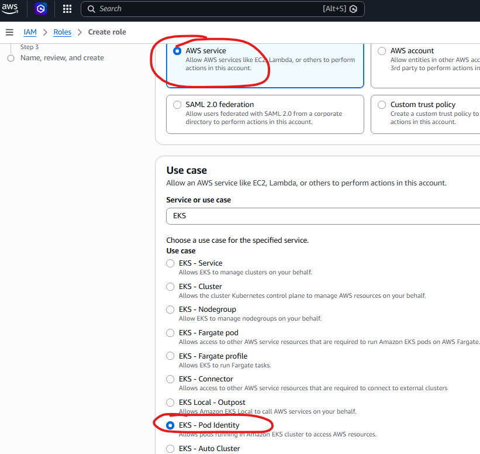
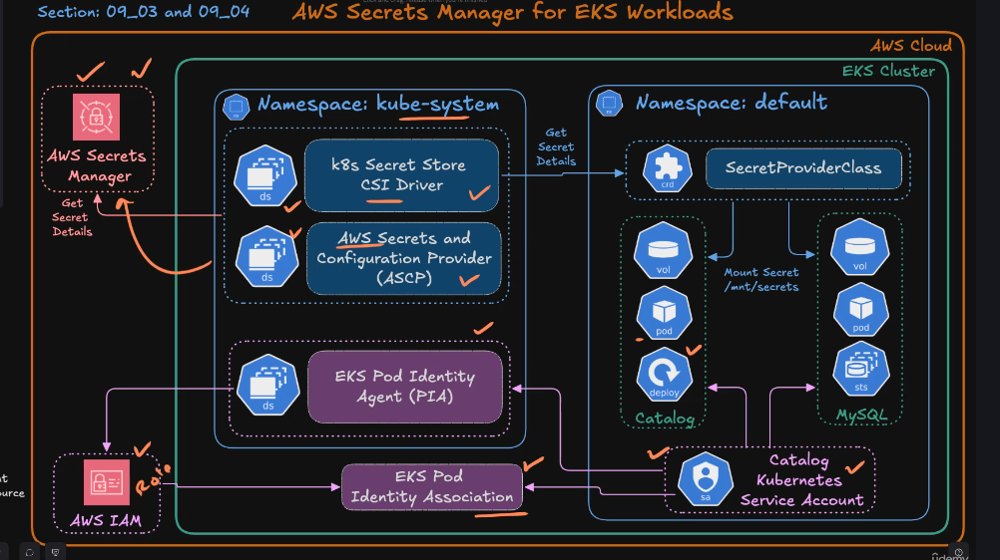

# Activity Log

## Running a Pod

### Prerequisites

1. sandbox-1-eks-cluster running in eu-west-1 region
2. kubectl installed and configured to point to your cluster


### Steps
1. Set AWS credentials in ~/.aws/credentials
2. Configure kubectl to point to your cluster:
    ```bash
    aws eks --region eu-west-1 update-kubeconfig --name sandbox-1-eks-cluster
    ```

3. Verified that kubectl is configured correctly:
    ```bash
    kubectl get nodes
    ```

4. Create a pod using the following manifest:
    ```bash 
    kubectl apply -f 08_Kubernetes_Foundation/08_01_Kubernetes_Pods/catalog_k8s_manifests/01_catalog_pod.yaml 
    ```

5. Verify that the pod is running:
    ```bash
    kubectl describe pod catalog-pod

    kubectl get pods

    kubectl logs catalog-pod

    ```
6. Connect to the application:
    ```bash
    kubectl port-forward pod/catalog-pod 7080:8080 

    # Open in browser:
    # http://localhost:7080/health
    # http://localhost:7080/topology
    # http://localhost:7080/catalog/products

    # Get logs again to see the traffic:

    kubectl logs catalog-pod
    
    ```
7. Connect to the pod using exec:
    ```bash
    kubectl exec -it catalog-pod -- /bin/bash

    # Inside the pod, you can run commands like:
    curl http://localhost:8080/health
    curl http://localhost:8080/topology
    curl http://localhost:8080/catalog/products

    # Exit the pod
    exit
    ```

8. Clean up the pod:
    ```bash
    kubectl delete pod catalog-pod
    ```

    

## Creating a Deployment

### Prerequisites

1. sandbox-1-eks-cluster running in eu-west-1 region
2. kubectl installed and configured to point to your cluster

### Steps
1. Set AWS credentials in ~/.aws/credentials
2. Configure kubectl to point to your cluster:
    ```bash
    aws eks --region eu-west-1 update-kubeconfig --name sandbox-1-eks-cluster
    ``` 

3. Create a deployment using the following manifest:
    ```bash
    kubectl apply -f 08_Kubernetes_Foundation/08_02_Kubernetes_Deployments/catalog_k8s_manifests/01_catalog_deployment.yaml
    ```

4. Verify that the deployment is running:
    ```bash
    # Get the deployment:
    kubectl get deployments

    # Get the replicasets created by the deployment:
    kubectl get replicasets

    # Get the pods created by the deployment:
    kubectl get pods

    # verify rollout status:
    kubectl rollout status deployment/catalog

    # Describe the deployment to see the details:
    kubectl describe deployment catalog
    

    # Describe the pod to see the details:
    kubectl describe pod <pod-name>

    # Access the application:
    kubectl port-forward deployment/catalog 7080:8080

    # Open in browser:
    # http://localhost:7080/health
    # http://localhost:7080/topology
    # http://localhost:7080/catalog/products

    # Scale the deployment to 3 replicas:
    kubectl scale deployment/catalog --replicas=3

    # Get the pods again to see the new pods  created by the deployment and node distribution:
    kubectl get pods -o wide

5. Testing Rolling Update:
    ```bash
    
    # Check current image version:
    kubectl describe deployment catalog | grep Image
    
    # Check rollout history:
    kubectl rollout history deployment/catalog
    
    # Update the deployment to use a new image version (Command):
    kubectl set image deployment/catalog catalog=public.ecr.aws/aws-containers/retail-store-sample-catalog:1.3.0

        # Note: You can just update the image version in the deployment manifest and apply it again using kubectl apply -f <manifest-file.yaml>

    # Verify the rollout status:
    kubectl rollout status deployment/catalog

    # Show replicasets to see the new replicaset created for the new version:
    kubectl get replicasets

        # Note the old replicaset is kept with 0 replicas to allow rollback if needed.

    # To rollback to the previous version:
    kubectl rollout undo deployment/catalog

        # Note: This will create new revision of the deployment with the old image version and scale it up, while scaling down the new version.

    # To rollback to a specific revision (e.g., revision 1):
    kubectl rollout undo deployment/catalog --to-revision=1
    

    # Get the pods again to see the new pods created by the deployment and node distribution:
    kubectl get pods -o wide

    # Clean up the deployment:
    kubectl delete deployment catalog

    ```


## Creating a Cluster IP Service

### Prerequisites

1. sandbox-1-eks-cluster running in eu-west-1 region
2. kubectl installed and configured to point to your cluster

### Steps
1. Set AWS credentials in ~/.aws/credentials
2. Configure kubectl to point to your cluster:
    ```bash
    aws eks --region eu-west-1 update-kubeconfig --name sandbox-1-eks-cluster
    ```

3. Deploy manifests for creating the deployment and service:
    ```bash
    kubectl apply -f 08_Kubernetes_Foundation/08_03_Kubernetes_Service/catalog_k8s_manifests/01_catalog_deployment.yaml
    ```

4. Verify that the deployment is running:
    ```bash
    kubectl get deployments
    kubectl get pods -l app.kubernetes.io/name=catalog
    ```


5. Verify EndpointSlices created for the service:
    ```bash
    kubectl get pods -o wide
    kubectl get endpointslices -l kubernetes.io/service-name=catalog-service
    ```

6. Verify Cluster IP Service Connectivity using Curl Pod:

    Run a test pod inside the same namespace:

    ```bash
    kubectl run test --image=curlimages/curl -it --rm -- sh
    ```

    Inside the pod:

    ```bash
    curl http://catalog-service:8080/topology
    ```

    Expected output:

    ```json
    {"databaseEndpoint":"N/A","persistenceProvider":"in-memory"}
    ```

    Then exit.

    > “This proves that even though our pods have dynamic IPs, we can consistently reach the catalog application using the service name.”


7. DNS Resolution Check:

    ```bash
    kubectl run dns-test --image=busybox:1.28 -it --rm
    ```

    Inside pod:

    ```bash
    nslookup catalog-service
    ```

    Explain how Kubernetes DNS automatically creates entries like:

    ```
    catalog-service.default.svc.cluster.local
    ```


8. Clean Up:

    ```bash
    # Delete k8s Resources
    kubectl delete svc catalog-service
    kubectl delete deploy catalog

    ### OR ###

    # Delete using YAML files
    kubectl delete -f catalog_k8s_manifests
    ```

## Using ConfigMaps:

### Usecases:

1. Allow us to pass configuration environment variables to our applications without hardcoding them in the container image.
2. Enable us to update configuration values without rebuilding the container image, allowing for more flexibility and easier maintenance.
3. Provide a way to decouple configuration from application code, making it easier to manage and update configurations across different environments (e.g., development, staging, production) without changing the application code.

4. It is possible to use ConfigMaps as Environment variables, Command-line arguments, or as configuration files mounted as volumes inside the pods.


### Prerequisites:


1. sandbox-1-eks-cluster running in eu-west-1 region
2. kubectl installed and configured to point to your cluster


### Steps:

1. Deploy manifests from 08_Kubernetes_Foundation/08_04_Kubernetes_ConfigMap/catalog_k8s_manifests/01_catalog_deployment_with_configmap.yaml which includes a ConfigMap and a Deployment that uses it.

    ```bash
    kubectl apply -f 08_Kubernetes_Foundation/08_04_Kubernetes_ConfigMap/catalog_k8s_manifests/01_catalog_deployment_with_configmap.yaml
    ```

2. Verify that the deployment is running and the ConfigMap is created:

    ```bash
    
    # Get Pods:
    kubectl get pods

    # Get ConfigMaps
    kubectl get configmaps
    

    # Describe the ConfigMap:


    # Connect to Pod and list Environment Variables:
    kubectl exec -it <catalog-pod-name> -- env

    ```

## Using Stateful Sets:

### Usecases - Stateful Sets:

1. StatefulSets are used for applications that require stable, unique network identifiers and persistent storage, such as databases (e.g., MySQL, PostgreSQL) or stateful applications (e.g., Kafka, Cassandra).

2. Pods are deployed in sequential order, and each pod gets a unique ordinal index (e.g., myapp-0, myapp-1, myapp-2) that is stable across rescheduling.

3. Pods are deleted in reverse order (e.g., myapp-2 is deleted before myapp-1), ensuring that the stateful application can maintain its state and data integrity during scaling or updates.

4. Each pod in a StatefulSet can have its own persistent volume claim (PVC) that is retained even if the pod is deleted, ensuring data persistence.

5. When statfulset pod is crashed or deleted, it will be recreated with the same name and attached to the same persistent volume, ensuring that the state is preserved.

### Usecases - Headless Services:

1. Headless services are used to provide direct access to individual pods in a StatefulSet, allowing applications to discover and communicate with specific pods using their stable network identities.

2. A headless service is created by setting the `clusterIP` field to `None` in the service manifest, which prevents Kubernetes from assigning a cluster IP to the service and instead creates DNS records for each pod in the StatefulSet.

3. There is no load balancing or proxying for headless services, and traffic is sent directly to the pods based on their DNS names, allowing for more efficient communication between pods in a stateful application.

4. This allows applications to access individual pods using their DNS names (e.g., myapp-0.myapp-headless.default.svc.cluster.local) and enables features like leader election or direct communication between pods in a stateful application.


### Wiering Miro Diagram:

[EKS - StatefulSet and Headless Service](https://miro.com/app/board/uXjVHfNd7V4=/)

### Prerequisites:

1. sandbox-1-eks-cluster running in eu-west-1 region
2. kubectl installed and configured to point to your cluster


### Steps:

1. Deploy manifests for creating the Catalog Deployment, ClusterIP Service, StatefulSet,Headless Service and ConfigMap:
    ```bash
    kubectl apply -f 08_Kubernetes_Foundation/08_05_Kubernetes_StatefulSet/catalog_k8s_manifests
    ```

2. Verify that the deployment and statefulset are running:
    ```bash
    
    # Verify Deployments and StatefulSets:
    kubectl get deployments
    kubectl get statefulsets
    
    kubectl get pods -o wide
    # Observe that the catalog pod names are suffixed with a unique ordinal index (e.g., catalog-mysql-0) and are distributed across nodes.

    # Observe logs of the statefulset pod and deployment :
    kubectl logs catalog-mysql-0
    kubectl logs deployment/catalog


    ```

3. Verify DNS Lookup for the headless service:
    ```bash
    
    # Run a test pod to check DNS resolution for the headless service:
    kubectl run dns-test --image=busybox:1.28 -it --rm

    # Inside pod - run nslookup for the headless service:
    nslookup catalog-mysql

    # Expected output should show the DNS entries for the headless service and the individual pods.
    # IMPORTANT: You should use this DNS name (catalog-mysql), in the ConfigMap to access the database from the application, 
    # as it will resolve to the correct pod IP address even if the pod is rescheduled to a different node.
    
    # Now get the pods and verify the IP address matches the DNS entry:
    kubectl get pods -o wide   

    ```

4. Test Ordered Deployment and Scaling:

    ```bash
    
    # Scale the statefulset to 3 replicas:
    kubectl scale statefulset catalog-mysql --replicas=3

    # Toscale down to 1 replica:
    kubectl scale statefulset catalog-mysql --replicas=1


    # Get the pods again to see the new pods created by the statefulset and node distribution:
    kubectl get pods -o wide

    # Observe that the new pods are created in order (catalog-mysql-1, catalog-mysql-2) and are distributed across nodes.

    # Now delete a pod and observe that it is recreated with the same name.:
    
    kubectl delete pod catalog-mysql-0

    # Get the pods again to see that catalog-mysql-0 is recreated:
    kubectl get pods -o wide

    # Observe that catalog-mysql-0 is recreated with the same name.

    # NOTE: This statefulset uses empty dir ephemeral storage, so when a pod is deleted, its data
    # will be lost. In a real application, you would typically use persistent volumes to ensure
    # data persistence across pod restarts or rescheduling.

    ```

5. Connect to mySQL databse via the headless service:

    ```bash
    
    # Run a test pod to connect to the MySQL database via the headless service:
    
    kubectl run mysql-client --image=mysql:8.0 --restart=Never -it -- mysql -h catalog-mysql -u ctalog_user -p


    # Enter password (from ConfigMap)

    # Once connected, you can run MySQL commands to verify connectivity and data persistence:

    show schemas;
    use catalogdb;
    show tables;
    slelect * from products;


    # Exit MySQL client
    exit

    # Exit test pod
    exit
    ```

6. Connect to the Application Service (Cluster IP) using port forwarding:

    ```bash
    
    # Get the service:
    kubectl get svc

    # Port forward the catalog service to access it locally:
    kubectl port-forward service/catalog-service 7080:8080


    # Open in browser:
    # http://localhost:7080/health
    # http://localhost:7080/topology
    # http://localhost:7080/catalog/products

    # Observe that the application is able to connect to the MySQL database via the headless service and return product data.

    ```

7. Clean Up:

    ```bash

    # Delete using YAML files
    kubectl delete -f 08_Kubernetes_Foundation/08_05_Kubernetes_StatefulSet/catalog_k8s_manifests  


    ```

## Using Secrets:

### Usecases:

1. Kubernetes Secrets are used to store and manage sensitive information such as database credentials, API keys, and other confidential data that should not be exposed in plain text within application code or configuration files.

2. Secrets are stored in an encoded format (base64) and can be accessed by applications running in Kubernetes through environment variables, files mounted as volumes, or via the Kubernetes API.

3. Secrets can be protected with fine-grained access control using Kubernetes RBAC, ensuring that only authorized users and applications can access the sensitive data.

### Prerequisites:

1. sandbox-1-eks-cluster running in eu-west-1 region
2. kubectl installed and configured to point to your cluster

### Steps:

1. Deploy manifests in 09_Kubernetes_Secrets/09_01_Kubernetes_Secrets/catalog_k8s_manifests/ which include a ConfigMap, Secret, StatefulSet and Deployment that uses them.

    ```bash
    kubectl apply -f 09_Kubernetes_Secrets/09_01_Kubernetes_Secrets/catalog_k8s_manifests
    ```

2. Verify Secret creation and that the application can access it:

    ```bash
    
    # Get Secrets:
    kubectl get secrets

    # Describe the Secret to see its details (without revealing the actual values):
    kubectl describe secret catalog-db

    # Get the Secret in YAML format to see the encoded values:
    kubectl get secret catalog-db -o yaml

    # Connect to the Catalog Pod and list Environment Variables to verify that Secret values are available as environment variables:
    kubectl exec -it <catalog-pod-name> -- env

    # Connet to the Catalog Service using port forwarding and test endpoints to verify that the application can connect to the database using the credentials from the Secret:

    kubectl port-forward service/catalog-service 7080:8080

    # Open in browser:
    # http://localhost:7080/health
    # http://localhost:7080/topology
    # http://localhost:7080/catalog/products


    ```

## Pod Identity:

### Usecases:

1. Pod Identity allows Pods access AWS services external to the cluster using IAM roles.


### Prerequisites:

1. sandbox-1-eks-cluster running in eu-west-1 region
2. kubectl installed and configured to point to your cluster

### Steps:

1. Install the Pod Identity agent in the cluster using the following command:

    ```bash
    # Option 1: Install using kubectl:
    
    kubectl apply -f https://raw.githubusercontent.com/aws/amazon-eks-pod-identity-webhook/master/deploy/manifest.yaml

    # Option 2: in AWS Console, go to EKS > Add-ons > Create add-on > Select "Amazon EKS Pod Identity Agent" from the list and follow the prompts to install it in your cluster.
    # Select all the defaults and click "Create" to install the add-on in your cluster.
    # Wait for it to turn from "Creating" to "Active" status before proceeding to the next step.

    ```

2. Verify that the Pod Identity agent is running in the cluster:  

    ```bash
    # Get the DaemonSet created for the Pod Identity agent: 
    kubectl get daemonset -n kube-system | grep pod-identity

    # Expected output:

    em
    NAME                     DESIRED   CURRENT   READY   UP-TO-DATE   AVAILABLE   NODE SELECTOR   AGE
    aws-node                 2         2         2       2            2           <none>          15d
    eks-pod-identity-agent   2         2         2       2            2           <none>          11m
    kube-proxy               2         2         2       2            2           <none>          15d
    
    # Get the pods:
    kubectl get pods -n kube-system | grep pod-identity

    

    ```
3. Install AWS CLI Pod without assosiating with pod identity and verify that it cannot access AWS services:

    ```bash
    # Deploy the manifests in: 09_Kubernetes_Secrets/09_02_EKS_Pod_Identity_Agent/kube-manifests:
    kubectl apply -f 09_Kubernetes_Secrets/09_02_EKS_Pod_Identity_Agent/kube-manifests

    # Verify that the pod is running:
    kubectl get pods -n aws-cli


    ```

4. Connect to the CLI Pod and try to list S3 buckets in the account:

    ```bash
    kubectl exec -it -n aws-cli -- aws s3 ls

    # Expected output: 
    aws: [ERROR]: An error occurred (NoCredentials): Unable to locate credentials. You can configure credentials by running "aws login".
    command terminated with exit code 253


    ```

5. Create Pod Identity role and associate it with the CLI Pod:

   
    In AWS Console:

    **A)** Go to IAM > Roles > Create Role > Select Entity - AWS Service**
    
   
    

    Click Next

    **B)** In the permissions section search for "AmazonS3ReadOnlyAccess" and select it, then click Next.


    **C)** Give the role a name: EKS-Pod-Identity-S3-ReadOnly-Role-101 and click Create Role.

    **D)** Go to EKS > sandbox-1-eks-cluster > Access > Pod Identity Association > Create Pod Identity Association:

    **E)** Select the AIM role created above (EKS-Pod-Identity-S3-ReadOnly-Role-101) and select the CLI pod (aws-cli-pod) to associate it with, then click Create.

    **F)** Select Namespace = default

    **G)** Select the Service Account created above (part of manifes)

    **H)** Click Create to create the association.

6. Test again:

    ```bash
    # Delete the CLI pod to allow it to be recreated with the associated IAM role:
    kubectl delete pod aws-cli-pod -n aws-cli
    
    # Deploy the pod again:
    kubectl apply -f 09_Kubernetes_Secrets/09_02_EKS_Pod_Identity_Agent/kube-manifests

    # Connect to the CLI Pod and try to list S3 buckets in the account again:
    kubectl exec -it -n aws-cli -- aws s3 ls

    # Expected output: List of S3 buckets in the account, proving that the pod can now access AWS services using the associated IAM role.

    ```

7. clean up:

    ```bash
    # Delete the CLI pod:
    kubectl delete -f 09_Kubernetes_Secrets/09_02_EKS_Pod_Identity_Agent/kube-manifests

    # Delete the Pod Identity Association in EKS Console

    # Delete the IAM Role created for Pod Identity in IAM Console

    ```
   


## Installing Secrets Store CSI Driver and ASCP (AWS Secrets and Configuration Provider):

### Usecases:

1. The Secrets Store CSI Driver allows Kubernetes applications to securely access secrets stored in external secret management systems (e.g., AWS Secrets Manager, HashiCorp Vault) by mounting them as volumes inside pods.

2. The AWS Secrets and Configuration Provider (ASCP) is a component of the Secrets Store CSI Driver that enables integration with AWS Secrets Manager, allowing Kubernetes applications running on EKS to retrieve secrets from AWS Secrets Manager and use them as environment variables or configuration files.



### Prerequisites:

1. sandbox-1-eks-cluster running in eu-west-1 region
2. kubectl installed and configured to point to your cluster
3. helm installed and configured to use with your cluster


### Steps:

1. Verify hemp is installed and configured correctly:

    ```bash
    helm version

    # If not installed - install using the following commands (Disable Zscaler):

    curl -fsSL -o get_helm.sh https://raw.githubusercontent.com/helm/helm/main/scripts/get-helm-3
    
    chmod 700 get_helm.sh
    
    ./get_helm.sh

    ```

2. Add the following helm repositories:

    ```bash
    helm repo add secrets-store-csi-driver https://kubernetes-sigs.github.io/secrets-store-csi-driver/charts
    helm repo add aws-secrets-manager https://aws.github.io/secrets-store-csi-driver-provider-aws
    helm repo update

    # Verify:

    helm repo list

    # Expected results:

    NAME                            URL                                                              
    secrets-store-csi-driver        https://kubernetes-sigs.github.io/secrets-store-csi-driver/charts
    aws-secrets-manager             https://aws.github.io/secrets-store-csi-driver-provider-aws    

    ```

3. Install the Secrets Store CSI Driver using Helm:

    ```bash
        
    # Install the Secrets Store CSI Driver in the kube-system namespace:
    helm install csi-secrets-store \
    secrets-store-csi-driver/secrets-store-csi-driver \
    --namespace kube-system

    # List all Helm releases across namespaces:
    helm list --all-namespaces

    # List releases only in the kube-system namespace:
    helm list -n kube-system

    # Verify installation status, pods, and resources created by the release:
    helm status csi-secrets-store -n kube-system


    # Verify pods:
    kubectl get pods -n kube-system -l app=secrets-store-csi-driver


    # Verify the daemonset created for the CSI driver.
    # Note: The Secrets Store CSI Driver is typically deployed as a DaemonSet, which ensures that an instance of the driver runs on each node in the cluster to provide access to secrets for pods running on those nodes:

    kubectl get daemonset -n kube-system -l app=secrets-store-csi-driver

    ```
4. Install the AWS Secrets and Configuration Provider (ASCP):

    ```bash
    
    # Install the ASCP provider in the kube-system namespace:
    helm install secrets-provider-aws \
        aws-secrets-manager/secrets-store-csi-driver-provider-aws \
        --namespace kube-system \
        --set secrets-store-csi-driver.install=false

    

    # List releases only in the kube-system namespace:
    helm list -n kube-system

    # You should see 2 releases now: one for the Secrets Store CSI Driver and one for the AWS Secrets Manager provider.

    # Verify installation status, pods, and resources created by the release:
    helm status secrets-provider-aws -n kube-system

    # Verify pods and daemonsets created for the ASCP provider:
    kubectl get pods -n kube-system -l app=secrets-provider-aws 
    kubectl get daemonset -n kube-system -l app=secrets-provider-aws

    ```

5. Create Reusable Terrafrom modeule for creating POD Association components that allows access to AWS Secrets Manager secrets via the ASCP provider:

     [Link to Module Code](https://github.com/SKF-Internal/compassai-sandbox-1/tree/main/terraform/modules/secret_pod_identity_association)

    Create a Terraform module that includes:

    * Create Secret in AWS Secrets Manager with the necessary permissions for the application to access it:
    ```bash

        # NOTE: I created this as hardcoded terrafrom resource in base module !

        aws secretsmanager create-secret \
        --name catalog-db-secret-1 \
        --region $AWS_REGION \
        --description "MySQL credentials for Catalog microservice" \
        --secret-string '{
            "MYSQL_USER": "mydbadmin",
            "MYSQL_PASSWORD": "kalyandb101"
        }'
    ```
   
    *  Create an IAM policy allowing Pods to read a specific AWS secret.
    *  Create an IAM role trusted by the **EKS Pod Identity Agent**.
    *  Attach the policy to the role.
    *  Associate that IAM role with the **Kubernetes ServiceAccount** (`catalog-mysql-sa`).
    *  Verify the Pod Identity association.

    This module can then be reused to create multiple associations for different applications and secrets by providing different input variables (e.g., secret names, service account names, etc.)

    * Deploy the module !


6. 


## XXXX:

### Usecases:

### Prerequisites:

### Steps:


## XXXX:

### Usecases:

### Prerequisites:

### Steps:


## XXXX:

### Usecases:

### Prerequisites:

### Steps:


## XXXX:

### Usecases:

### Prerequisites:

### Steps:


